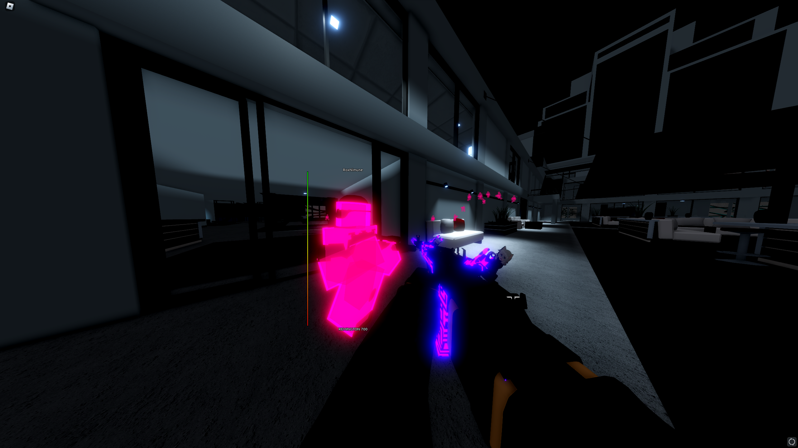

without failure success is merely a pipedream

Avid fullstack & game dev

## Tech

| 
Languages      
 | 
Markdown    
 | 
Database  
 | 
Machine Learning  
 | 
Design 
 | 
Cloud    
 | 
| - | - | - | - | - | - | 

<!--
**Languages**

     

**Markdown** 

   

**Database**

 

**Machine Learning**

 

**Design**

**Cloud**

  
-->

## Projects

 <!-- both work, toc or user-content-toc -->
  <ul style="list-style: none;">
    

      <!-- style is for vsc md renderer to remove underline -->
      <h2 style="border: 0"><b>FailedHit</b> Universal Multi-hack</h2>
    

  </ul>

Game modification client built for Roblox. 50k+ lines of code with a custom designed user interface and auth system. Optimized for peak competitive performance.

  <ul style="list-style: none;">
    

      <h2 style="border: 0"><b>LuaDisassembler</b> A disassembler for compiled Lua code in JavaScript</spawn></h2>
    

  </ul>

LuaDisassembler is a node script that converts a [Lua](https://lua.org/) binary into intelligible data. It can be used to decompile into psuedo code, or used for general purpose analysis of a program.